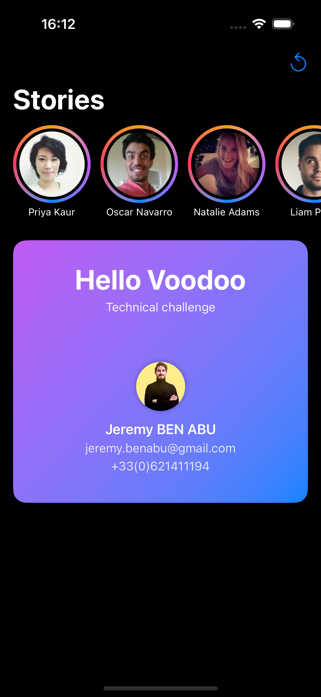
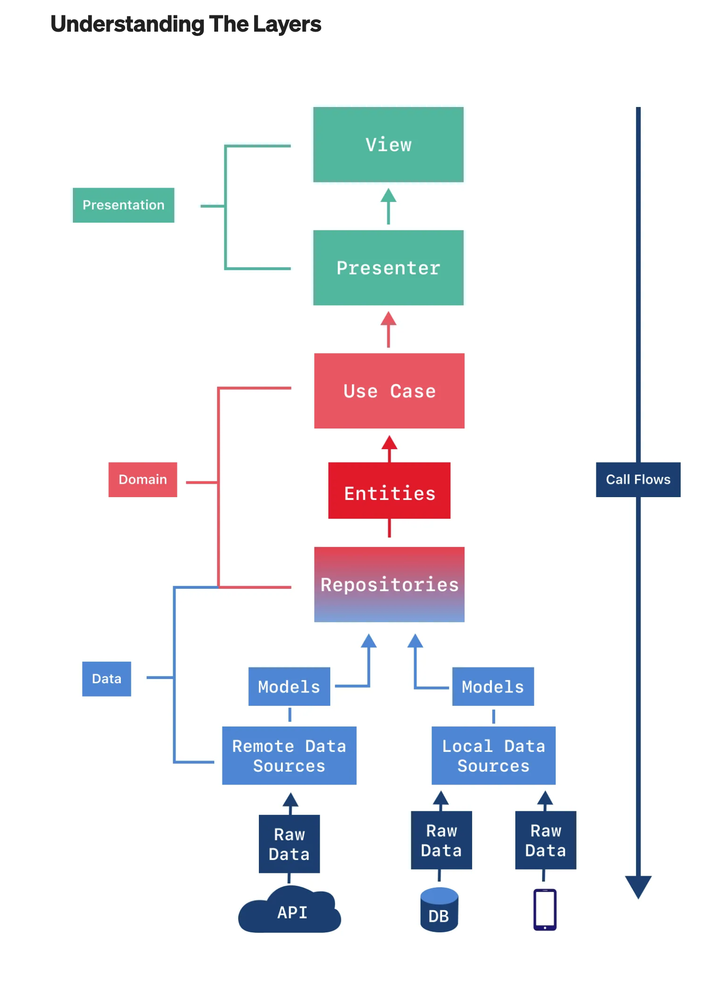

# Stories – Technical Test

This project is a SwiftUI application implementing an Instagram Stories-like feature as part of a technical test. The app is built using **MVVM** and **Clean Architecture** principles for maintainability and scalability.

📸 Screenshots

[](images/Sample.gif)
[](images/Screenshot1.png)
[](images/Screenshot2.png)
[](images/Screenshot3.png)

## Features

- **Story List**: Horizontally scrollable, infinite carousel of users, each displaying their avatar and name.
- **Story View**: Displays all stories for a selected user, with smooth paging and transitions.
- **Instagram-like Behavior**:
  - Tap left/right to navigate between stories.
  - Stories are marked as seen when all stories from a user are displayed.
  - Like/unlike stories with instant feedback.
- **Infinite Paging**: The remote repository first loads data from two JSON files, then generates additional mock data on the fly to demonstrate infinite pagination.

## Architecture

- **MVVM**: All UI logic is handled in ViewModels, keeping Views declarative and simple.
- **Clean Architecture**: The codebase is organized into layers (Presentation, Domain, Data), with clear separation of concerns and dependency inversion.
[](images/CleanArch.png)

- **Storage Layer**: Uses `FileManager` for local persistence by default. The storage logic is encapsulated in a dedicated layer, making it easy to migrate to other solutions (e.g., CoreData) in the future.

```
App
│
└── StoryModule
    │
    ├── Data
    │   ├── Models         // Data models (Codable structs)
    │   ├── Network        // API endpoints and networking logic
    │   └── Repositories   // Abstract data access layer
    │
    ├── Domain             // Business logic, use cases, entities
    │
    ├── Presentation
    │   ├── Views          // SwiftUI views driven by `@Published` states
    │   └── ViewModels     // Bind views to business logic
    │
    └── Utilities          // Extensions, helpers, etc.
```

## Technical Details

- **SwiftUI** for all UI components.
- **Combine** for state management and data flow.
- **FileManager** for local storage, with a pluggable storage interface.
- **Mock Remote Repository**: Loads initial data from bundled JSON files, then generates new data for subsequent pages to simulate an endless feed.

## Getting Started

1. Open the project in Xcode.
2. Build and run the app on the simulator or a device.
3. Explore the Stories feature: scroll horizontally, tap on users, view and interact with their stories.

---

Created by Jeremy Ben Abu on 30/06/2025

